# VPN without ingress traffic

Setup your own personal VPN without any allowed ingress to your home network.

## TL;DR

- Set a Cloudflare account with a free plan (50 users) for Access;
- Configure the environment variables `CLOUDFLARE_API_KEY` and `CLOUDFLARE_EMAIL`;
- Run `cd scripts && bash setup-cloudflare-tunnel.sh` to create the tunnel;
- Install the tunnel connector for the tunnel on the machine that should act as the VPN server;
- Install WARP on the client machine and login into your Access organization.

## Overview

Traditionally, VPN have been used to allow clients/users to access resources in private networks, or
to bypass geo-location restrictions. In any case, a VPN server is required to receive the network
traffic from the client and forward it to the intended destination which the server has access to.

In general, the network traffic goes like this: `Client -> VPN Server -> Destination`

> The Destination will see the traffic coming from the VPN Server, not the client.

The problem with this solution is that, now you have a resource that is open to the internet (public)
which is hte VPN Server in this case, and so, it requires regular patching maintenance to avoid
the chance of being attacked by any bad actor.

As just one example on how important it is to keep public resources updated and secure, it was reported
that One of the hacks suffered by LastPass happened because one of their engineers had his Plex Server
Publicly accessible from the internet and wasn't up-to-date (**TODO add link to lastpass hack**).

**The objective is to have the same VPN-like features, but without any public resources that
we need to maintain**. Since any entity that will receive the TCP/UDP connection request needs to be public,
we need a public proxy/middleware that we don't maintain between the VPN Server and the Client.
In this case, this proxy will be Cloudflare. So the network traffic would go like
`Client -> Cloudflare -> VPN-like server (called connector) -> Destination`.

A general diagram is also provided by Cloudflare:

Solutions like those exist, but they require the Server to allow public ingress traffic from the proxy.

💡 The trick to avoid allowing ingress traffic from Cloudflare to the server is the fact
that who establishes/requests the connection is the Server, not Cloudflare. However, the traffic flows in the opposite
direction, from Cloudflare to the Server. This allows the Server to operate like one, but without any ingress allowed
(egress traffic to Cloudflare is required)

So, to start using this solution,we first need a Cloudflare account with Access (one of their products) enabled.
The following section shows how to set it up.

## Cloudflare Account Setup

Beginning with the Cloudflare account, which you can create [here](TODO-LINK-TO-CLOUDFLARE)
you need nothing more than an email. You also don't need a registered domain name to
follow this tutorial. Just enable MFA to play it safe.

After that, click on the link as shown below to access the Zero Trust dashboard.

<!-- TODO set max width -->
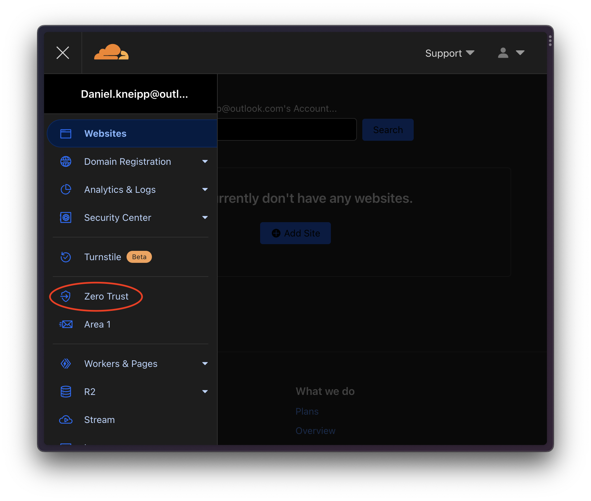

If it is the first time you are accessing this, you will be prompted to create an organization.
This is just a way Cloudflare uses to manage users and access rules in general. You can configure
any unique name you want. Just keep it noted because it will be used when configuring the VPN-like
client called WARP later on.

Also, you will be prompted to add to select a plan and a payment method. Select the free plan with 50
users. You can add any payment method you prefer and you won't be billed as long as you don't change
your plan.

> Remember that we are using the free plan and this tutorial doesn't required a domain name. You can follow
> this tutorial fully for free

For more information about this process, feel free to also check the official [docs](https://developers.cloudflare.com/cloudflare-one/setup/#start-from-the-cloudflare-dashboard)

## Tunnel

A tunnel is basically an abstract entity from Cloudflare which associates one or more connectors (servers) with
networking rules which dictates what traffic will go through the servers. After creating the account, you should
see no tunnels, as shown below:

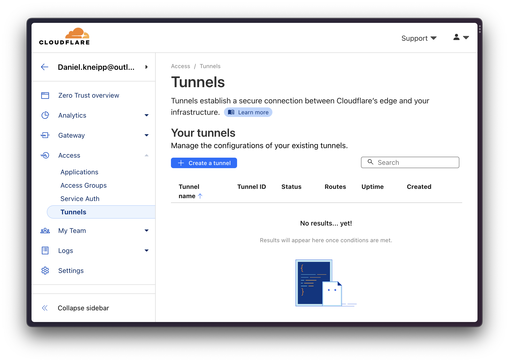

Now, we need to create a tunnel which will forward all the traffic (`0.0.0.0/0` and `::/0` for ipv6).
You can create the tunnel and the private network rules via the console if you want,
but here I'm also making available a script to automate this.

To use the script, you need:

- Set the `CLOUDFLARE_EMAIL` with your email used to create the account;
- Set the `CLOUDFLARE_API_KEY`;
- Configure the `ACCOUNT_NAME_PREFIX` at the top of `scripts/setup-cloudflare-tunnel.sh` with the Zero Trust account name

For the API key, you can follow these steps:

| Description | Image |
| --- | --- |
| From Cloudflare's homepage (*not the Zero Trust homepage*), go to "My Profile" | 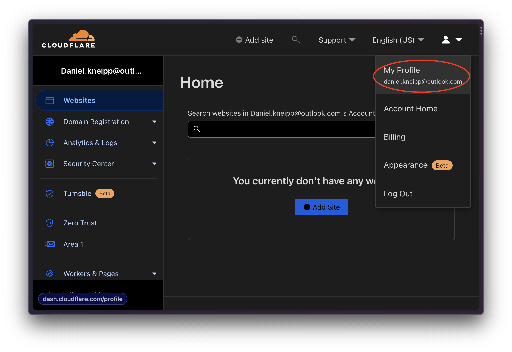 |
| Select to view Global API Key | 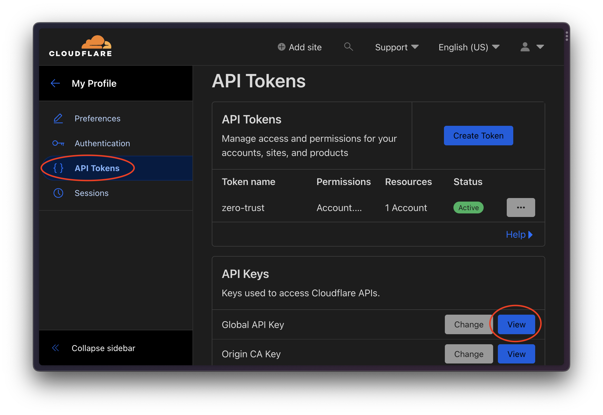 |

> You could also use API tokens, which are recommended as the yare scoped. The API key is being
> used here just to speed things up, but for any serious setup should consider API tokens instead.

And for the account name prefix, you need to go to "Configurations", in "Manage Account" on the bottom of
options, also on Cloudflare homepage, as shown below:

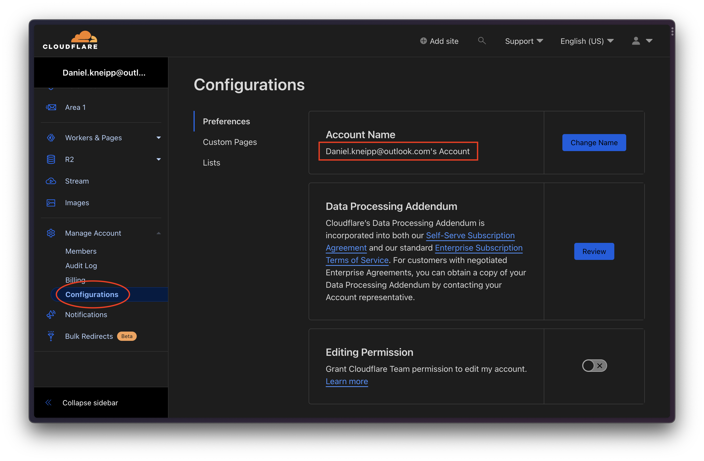

In my case, my account name is `"Daniel.kneipp@outlook.com's Account"`. Since the script accepts just a prefix,
I configured `ACCOUNT_NAME_PREFIX` to `"Daniel.kneipp@outlook.com"` on `scripts/setup-cloudflare-tunnel.sh`.
Remember to change this to the appropriate one for you.

With all configured, now it is just a matter of running `cd scripts/ && bash setup-cloudflare-tunnel.sh`.
If everything works fine, you should see an output like the following one:

<!-- TODO set max width -->
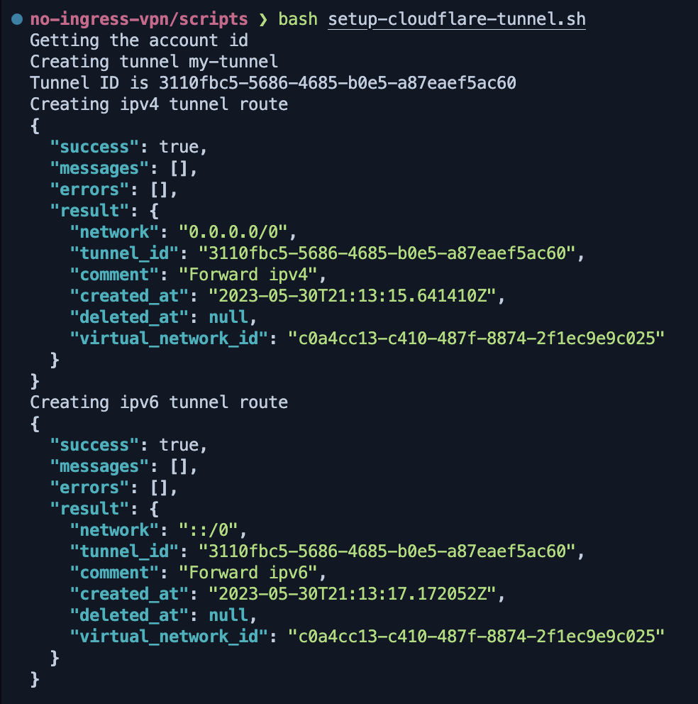

And you can confirm the tunnel and network rules creation on the Cloudflare Zero Trust console as well:

| Description | Image |
| --- | --- |
| Tunnel created but still not active because not connectors have been deployed | 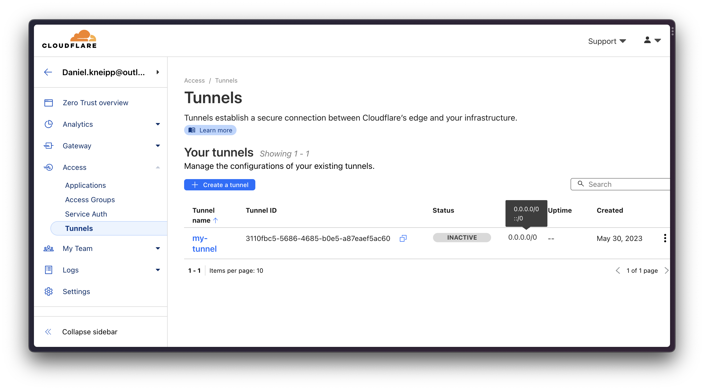 |
| Network rules forcing all the traffic to any destination to go through the connectors associated with this tunnel | 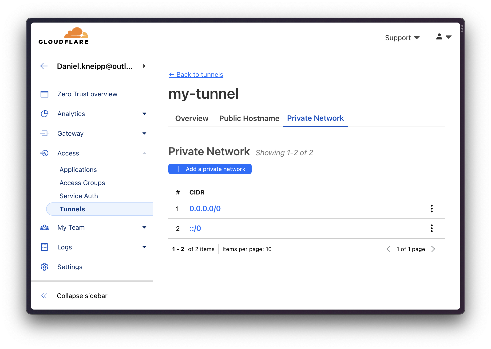 |

> You can also limit what goes through the connector if you have knowledge of the destination ips.
> This is also possible for domain names that you own and are registered on Cloudflare (on the same account).

## Connector

When accessing the tunnel, you can see instructions on how to setup the connectors for various environments like Linux, Windows or Docker.
My objective is to deploy this connector on a Windows PC I have, so I selected Windows 64 bit, as show below:

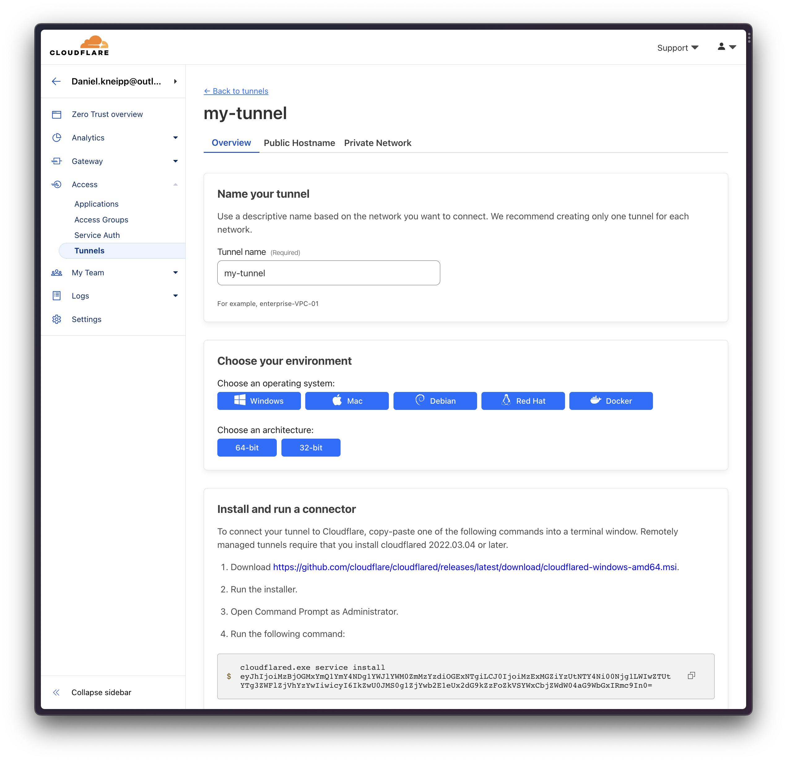

**Important:** treat this big token as a password! Anyone possessing this can create a connector and be assigned to your tunnel.
This will essentially allow your traffic to be hijacked.

So in my case, I installed this `.msi` and ran the `cloudflared` command.

You will be able to confirm if the connector was correctly registered on the dashboard. If nwo the tunnel shows healthy as below,
it means the connector have been registered.

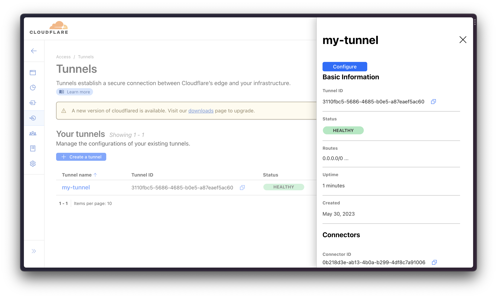

Now you have the `Cloudflare -> Server` part of the flow configured. The only part missing is `Client -> Cloudflare`

## WARP Client

As many VPNs, Cloudflare also requires the usage of a software installed in the client to be properly configured.
This software is called Cloudflare WARP. You can install it from [here](TODO-LINK-TO-WARP).

After installing it, you need to enroll the device to the Cloudflare Zero Trust organization you created earlier.

> Note: don't enable WARP just yet. You can, but you will only be connected to the Cloudflare network, but not
> to your organization. So your tunnel and network rules won't have any effect.

### Device enrollment

To be able to enroll your device, you first need to configure rules to allow the device to be enrolled.
For that, follow those instructions:

| Description | Image |
| --- | --- |
| Go to the WARP client settings on the Cloudflare Zero Trust dashboard | 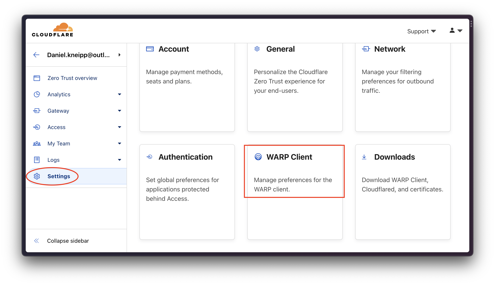 |
| Click on Manage Device Erollment Permissions | 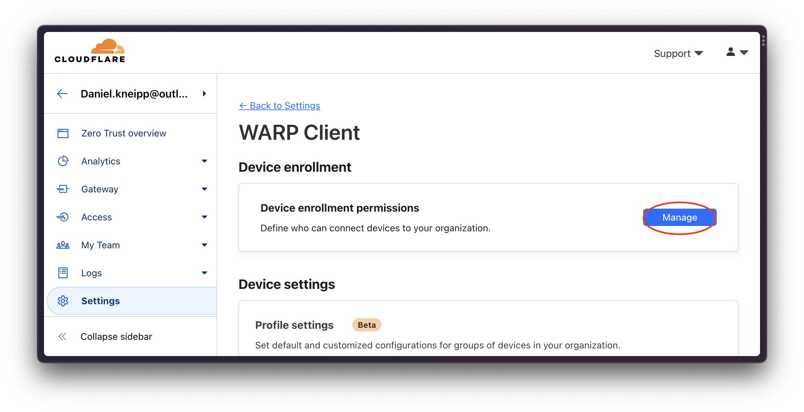 |
| Configure an `allow` rule for your own email. This means that a device that tries to logi via WARP into your organization using your email and succeeds should be allowed in the organization | 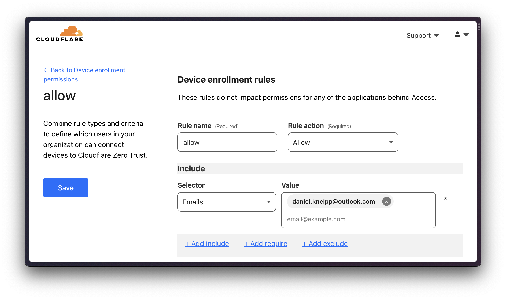 |

### Connect client

With this, you only need is to login via WARP to the organization. You can do this via the command line with `warp-cli team-enroll <org-name>`,
or via the WARP UI, going to Preferences and the Account tab.

With a successful login, the pop-up from Cloudflare WARP should show this:

<!-- TODO set max width -->
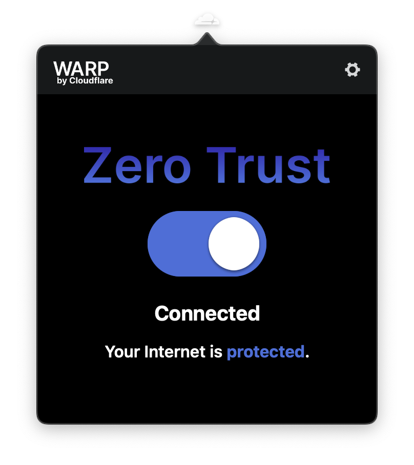

And with that, your traffic should be already going through the connector, instead of directly to the destination.
You can also confirm this by going to any website that prints out your ip and geo-location properties.
Your should see the ip and geo-location from the connector, not form the client at this point.

## Appendix

### What about terraform support

Although Cloudflare has some support to terraform, it certainly doesn't cover everything.
Currently we have two ways to manage tunnels on Cloudflare: by local configuration or remotely managed via Cloudflare.
The later is more convenient as it allows us to manage all connectors associated with a tunnel remotely and
allows us to avoid adhoc configuration per connector. It is also the [recommended way](TODO-LINK-CONNECTOR-RECOMENDS) by Cloudflare
to managing connectors.

> You can see more differences between the management strategies [here](https://developers.cloudflare.com/cloudflare-one/connections/connect-apps/install-and-setup/tunnel-permissions/)
> Also, Whenever you deploy a connector without specifying a configuration file (as show by the instructions from the Cloudflare dashboard),
> you are deploying a remotely-manage connector

The important takeaway is: if you try to deploy a locally managed connector, you need, for some still unknown reason 🤷‍♂️, have a domain name
registered with your Cloudflare account. When you run `cloudflared login` this is required and you can't finish the authentication
procedure without it.

The problem? The current Cloudflare provider doesn't support the creation of remotely-managed tunnels, only locally managed ones. So
every time you try to deploy the resources via terraform, you get errors like `Authentication error (10000)`.

Luckily, Cloudflare has an API with full support to both types of connectors. So we are using the API instead ([docs](TODO-LINK-API-DOCS))

If you a curious about what the terraform setup would look like, you can check the `terraform` branch of this repo.
The code will be there in the `tf/` directory

----

extensive tutorial: https://programmingpercy.tech/blog/free-secure-self-hosting-using-cloudflare-tunnels/
