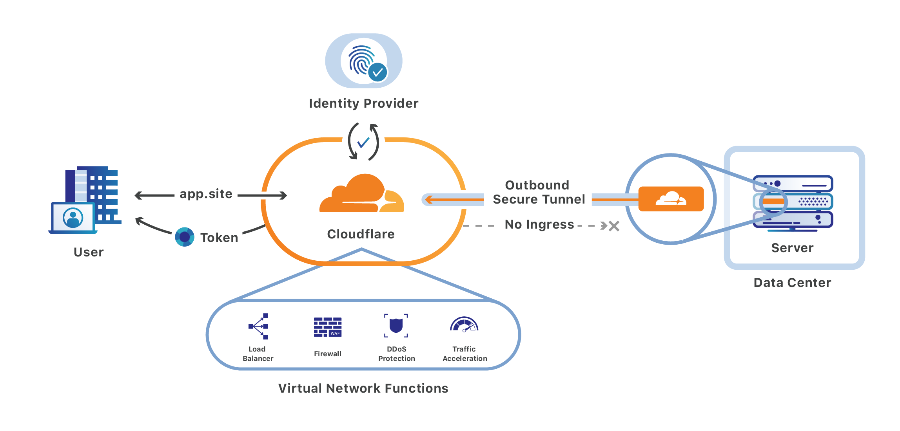

# no-ingress-vpn
Setup your own personal VPN without any allowed ingress to your home network.

- Create a cloudflare account
- Access the zero trust space
- complete the onboarding screen and define a team name ([docs](https://developers.cloudflare.com/cloudflare-one/setup/#start-from-the-cloudflare-dashboard))
  - Select org name
  - Select free bundle for 50 users
  - Add payment method

- Set a device enrollment permission to allow yourself to login using warp to your org

- Install warp
- login using the org name defined previously

export CLOUDFLARE_API_KEY and CLOUDFLARE_EMAIL

extensive tutorial: https://programmingpercy.tech/blog/free-secure-self-hosting-using-cloudflare-tunnels/

Can't create tunnel via terraform because the creation process requires us to have a domain (otherwise it keeps giving us `Authentication error (10000)`), which we don't need to have for this. Create the tunnel and network rules via the ui or api instead

https://developers.cloudflare.com/cloudflare-one/connections/connect-apps/install-and-setup/tunnel-permissions/

